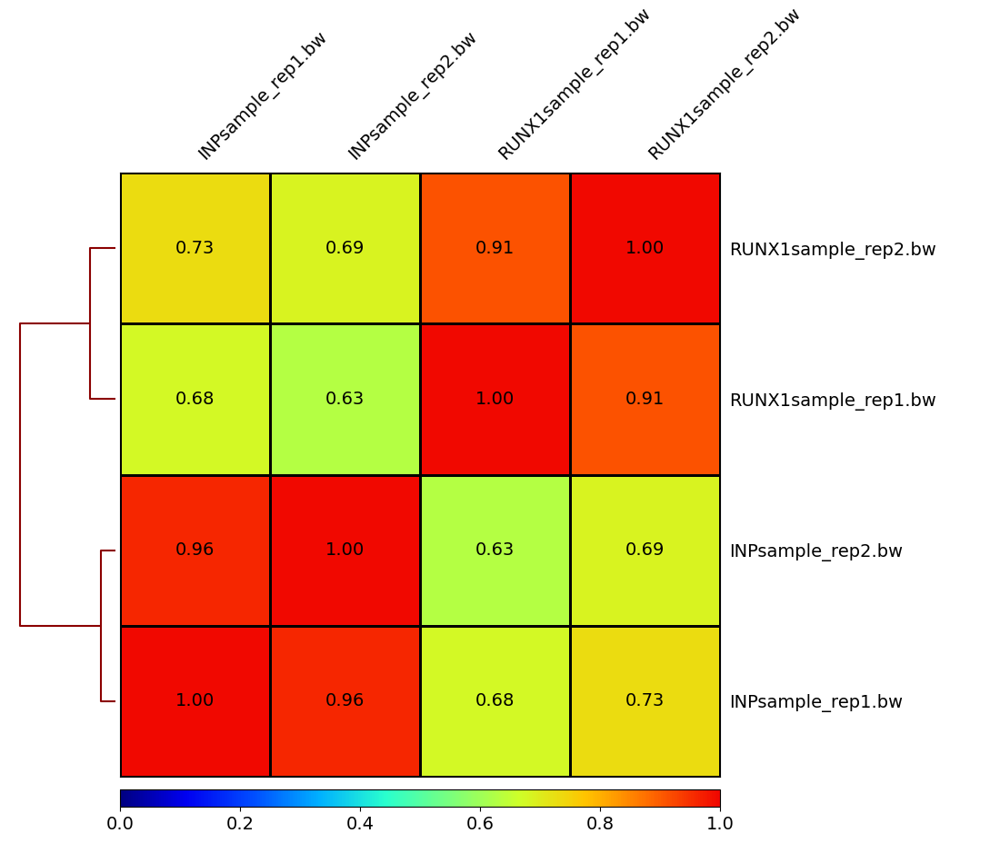
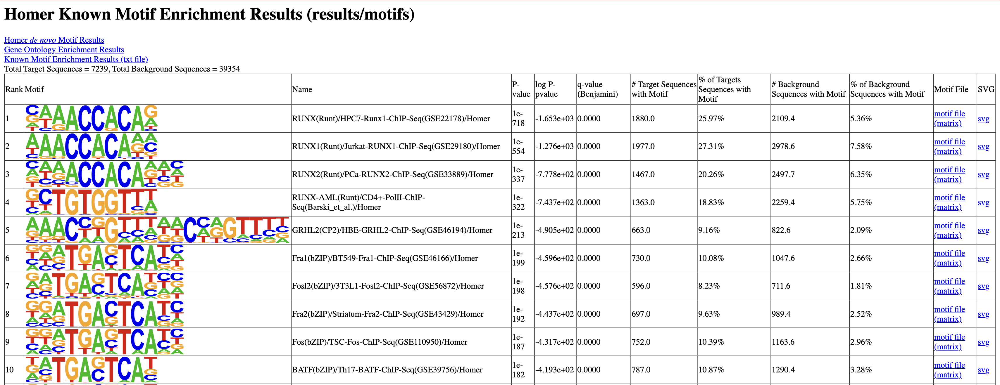
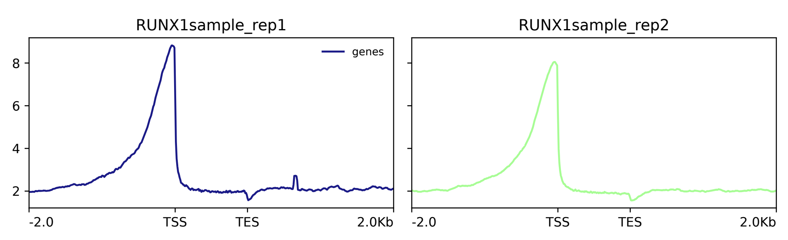
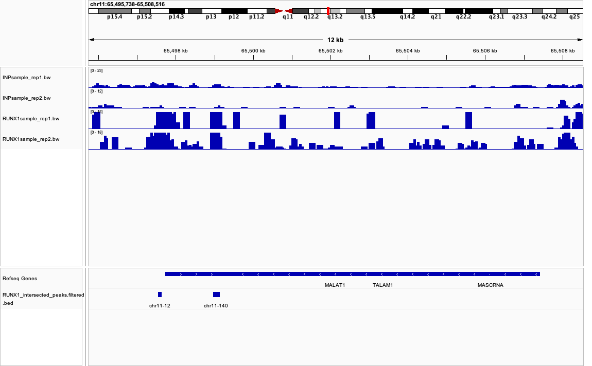

# 🧬 ChIP-seq Analysis of Runx1 

**Organism:** Human (GRCh38/hg38)  
**Goal:** Identify and analyze genomic binding sites of the transcription factor Runx1 using ChIP-seq from two biological replicates.

## Overview

This project executes a full ChIP-seq pipeline: from quality control and alignment to peak calling, reproducibility filtering, annotation, motif discovery, and signal profiling.

## Workflow Summary

### Preprocessing
- **Quality Check:** `FastQC v0.12.1`
- **Adapter Trimming:** `Trimmomatic v0.39`

### Alignment
- **Genome Indexing & Mapping:** `Bowtie2 v2.5.3`
- **Sorting & Indexing:** `SAMtools v1.19.2`
- **QC Metrics:** `samtools flagstat` + `MultiQC v1.20`

### Signal Generation & Visualization
- **Signal Tracks:** `bamCoverage → .bw`
- **Sample Similarity:** `deeptools plotCorrelation`
- **Signal Across Genes:** `plotProfile`

### Peak Calling & Filtering
- **Tag Directory:** `HOMER makeTagDirectory`
- **Peak Calling:** `HOMER findPeaks`
- **BED Conversion:** `pos2bed.pl`
- **Reproducible Peaks:** `bedtools intersect`
- **Blacklist Filtering:** `bedtools subtract`

### Annotation & Motif Analysis
- **Annotation:** `HOMER annotatePeaks.pl` using Ensembl GTF
- **Motif Discovery:** `HOMER findMotifsGenome.pl`
- **Gene Enrichment:** from annotated peak regions

## Key Findings

| Step                          | Count       |
|------------------------------|-------------|
| Peaks in Replicate 1         | 134,167     |
| Peaks in Replicate 2         | 26,766      |
| Reproducible Peaks (Overlap) | 7,269       |
| After Blacklist Removal      | 7,240       |

- **Duplication Rates:** Higher in IP (Runx1) due to targeted enrichment  
- **GC Bias:** IP samples show GC enrichment — expected, but requires normalization  
- **Peak Discrepancies:** Likely due to differing thresholds, experimental noise, or sensitivity  
- **Intergenic Binding Sites:** Suggest distal regulatory roles (enhancers, silencers)

## Biological Insights

- Not all DEGs had proximal Runx1 binding — possibly due to:
  - Long-range enhancer regulation
  - Indirect TF cascades
  - Weak or undetectable binding

- Intergenic peaks may be functional:
  - **Suggested follow-ups**: ATAC-seq, H3K27ac ChIP, or DNA methylation analysis

## 📊 Plots & Visualizations

### Correlation Heatmap

### Top Motifs (HOMER)

### Signal Coverage Across Genes

### IGV Browser Snapshot (MALAT1 Locus)

